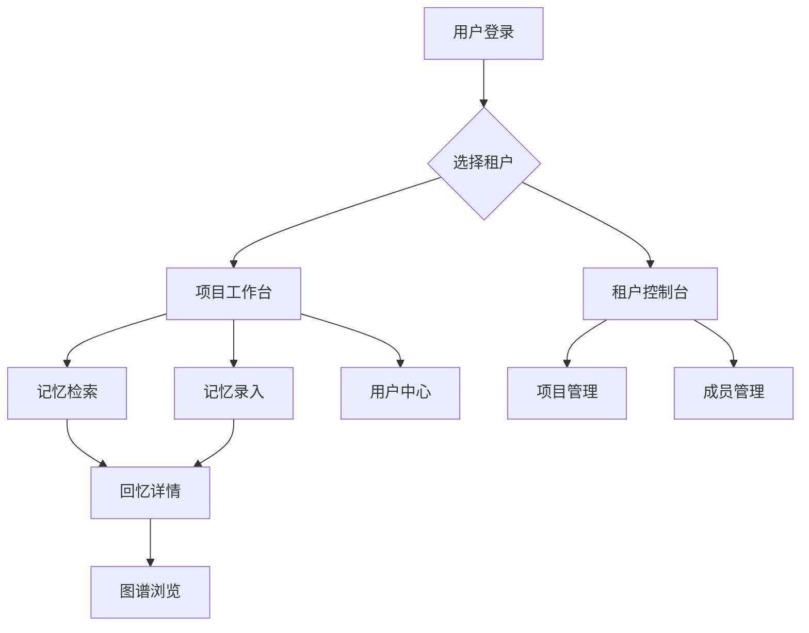

## 1. 产品概述
记忆管理系统是一个支持多租户、多项目、多用户的智能记忆管理平台。系统通过图增量刷新技术实现高效的知识图谱更新，提供智能检索与回忆功能，帮助用户快速定位和复用历史知识。

主要解决企业级知识管理中的信息孤岛问题，为团队协作提供统一的知识记忆中心，提升工作效率和知识复用率。

## 2. 核心功能

### 2.1 用户角色
| 角色 | 注册方式 | 核心权限 |
|------|----------|----------|
| 租户管理员 | 企业邮箱注册 | 管理租户信息、创建项目、分配用户权限 |
| 项目管理员 | 租户管理员邀请 | 管理项目成员、配置项目记忆规则 |
| 普通用户 | 项目邀请或公开注册 | 创建和检索记忆内容、参与协作 |
| 访客用户 | 无需注册 | 只读访问公开项目内容 |

### 2.2 功能模块
系统包含以下核心页面：
1. **租户控制台**：租户概览、项目管理、成员管理、计费配置
2. **项目工作台**：项目概览、记忆图谱、成员协作、设置管理
3. **记忆检索页**：智能搜索、图谱浏览、关联推荐、历史记录
4. **记忆录入页**：文本输入、文件上传、标签管理、自动提取
5. **回忆详情页**：内容展示、关系图谱、版本历史、协作讨论
6. **用户中心**：个人资料、权限管理、使用统计、偏好设置

### 2.3 页面详情
| 页面名称 | 模块名称 | 功能描述 |
|----------|----------|----------|
| 租户控制台 | 租户概览 | 显示租户基本信息、使用统计、活跃项目数 |
| 租户控制台 | 项目管理 | 创建项目、编辑项目信息、删除项目、项目权限设置 |
| 租户控制台 | 成员管理 | 邀请用户、角色分配、权限控制、成员状态管理 |
| 项目工作台 | 项目概览 | 显示项目基本信息、活跃记忆数、协作成员 |
| 项目工作台 | 记忆图谱 | 可视化展示知识点关联关系、支持拖拽和缩放操作 |
| 项目工作台 | 成员协作 | 显示在线成员、协作记录、权限变更日志 |
| 记忆检索页 | 智能搜索 | 支持全文搜索、语义搜索、标签筛选、时间范围筛选 |
| 记忆检索页 | 图谱浏览 | 以图谱形式展示搜索结果、支持节点点击查看详情 |
| 记忆检索页 | 关联推荐 | 基于当前搜索内容推荐相关知识 |
| 记忆录入页 | 文本输入 | 支持富文本编辑、Markdown语法、实时预览 |
| 记忆录入页 | 文件上传 | 支持文档、图片、视频上传，自动提取文本内容 |
| 记忆录入页 | 标签管理 | 自动标签提取、手动标签添加、标签层级管理 |
| 回忆详情页 | 内容展示 | 展示记忆内容、创建时间、作者信息、版本信息 |
| 回忆详情页 | 关系图谱 | 显示当前知识点的关联关系、支持交互式浏览 |
| 回忆详情页 | 版本历史 | 显示内容变更历史、支持版本对比和回滚 |
| 用户中心 | 个人资料 | 编辑个人信息、头像上传、联系方式设置 |
| 用户中心 | 权限管理 | 查看当前权限、申请权限变更、权限审批记录 |

## 3. 核心流程

### 租户管理员流程
1. 注册租户账户 → 2. 创建组织信息 → 3. 邀请项目管理员 → 4. 配置计费方案 → 5. 监控使用情况

### 项目管理员流程
1. 接受租户邀请 → 2. 创建项目 → 3. 配置记忆规则 → 4. 邀请项目成员 → 5. 管理项目内容

### 普通用户流程
1. 注册/登录系统 → 2. 加入项目 → 3. 创建/检索记忆 → 4. 参与协作讨论 → 5. 管理个人内容

### 图增量刷新流程
1. 内容录入触发 → 2. 实体关系提取 → 3. 图谱差异计算 → 4. 增量更新应用 → 5. 索引重建优化

## 4. 用户界面设计

### 4.1 设计风格
- **主色调**：深蓝色 (#1E40AF) 搭配浅灰色 (#F3F4F6)
- **按钮样式**：圆角矩形，主要操作为实心按钮，次要操作为边框按钮
- **字体系统**：中文使用思源黑体，英文使用 Inter，正文字号 14px，标题字号 18-24px
- **布局风格**：左侧导航 + 右侧主内容区的卡片式布局
- **图标风格**：使用线性图标，统一 2px 线宽，圆角设计

### 4.2 页面设计概览
| 页面名称 | 模块名称 | UI元素 |
|----------|----------|----------|
| 租户控制台 | 租户概览 | 顶部统计卡片展示关键指标，使用渐变背景和阴影效果 |
| 项目工作台 | 记忆图谱 | 全屏图谱展示区域，左侧工具栏，顶部搜索框，支持缩放和平移 |
| 记忆检索页 | 智能搜索 | 顶部搜索栏支持语音输入，左侧筛选面板，右侧结果列表 |
| 回忆详情页 | 关系图谱 | 右侧边栏展示图谱缩略图，主内容区支持标签化展示 |
| 用户中心 | 个人资料 | 左侧头像和信息卡片，右侧编辑表单，支持实时预览 |

### 4.3 响应式设计
- **桌面优先**：默认支持 1440px 以上大屏显示
- **平板适配**：768px-1439px 范围内采用折叠式导航
- **移动适配**：小于 768px 时采用底部标签导航
- **触摸优化**：所有交互元素最小点击区域 44px，支持手势操作

### 4.4 图谱可视化指导
- **节点设计**：不同颜色区分实体类型，大小反映重要性程度
- **连线样式**：实线表示直接关系，虚线表示间接关系，粗细表示关联强度
- **交互反馈**：鼠标悬停高亮相关节点，点击展开详细信息
- **动画效果**：节点进入使用弹性动画，连线使用渐变动画