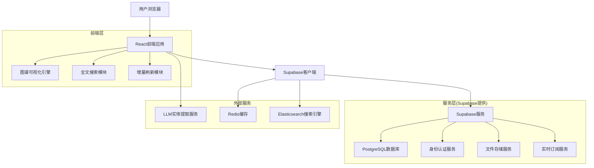
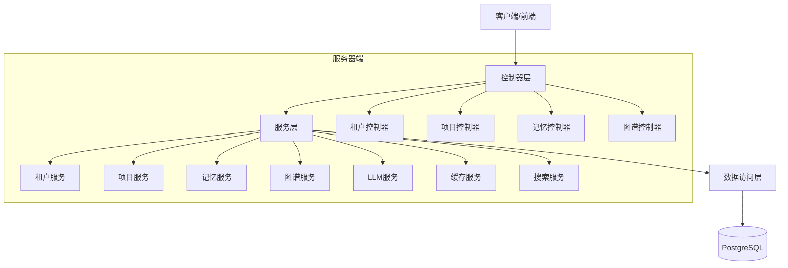
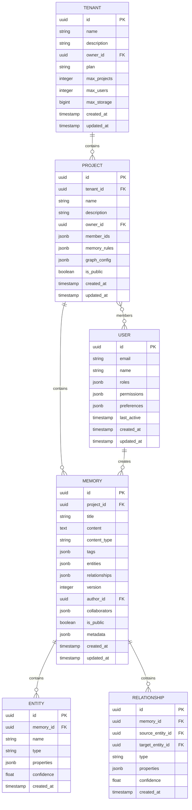

## 1. 架构设计



## 2. 技术描述
- **前端**：React@18 + TypeScript + TailwindCSS@3 + Vite
- **初始化工具**：vite-init
- **后端**：Supabase (PostgreSQL + 身份认证 + 文件存储)
- **图谱可视化**：@react-three/fiber + @react-three/drei + three.js
- **状态管理**：Zustand + React Query
- **UI组件库**：Ant Design + 自定义组件
- **测试框架**：Jest + React Testing Library + Playwright

## 3. 路由定义
| 路由 | 用途 |
|------|------|
| / | 登录页面，用户身份验证 |
| /tenant | 租户选择页面，多租户切换 |
| /dashboard | 项目工作台，主要工作区域 |
| /search | 记忆检索页面，智能搜索 |
| /memory/:id | 回忆详情页面，展示记忆内容 |
| /create | 记忆录入页面，创建新记忆 |
| /profile | 用户中心，个人信息管理 |
| /admin/tenant | 租户控制台，租户管理 |
| /admin/project | 项目控制台，项目管理 |

## 4. API定义

### 4.1 核心API

#### 租户管理相关
```
POST /api/tenants
GET /api/tenants/:id
PUT /api/tenants/:id
DELETE /api/tenants/:id
```

#### 项目管理相关
```
POST /api/projects
GET /api/projects/:id
PUT /api/projects/:id
DELETE /api/projects/:id
GET /api/tenants/:tenantId/projects
```

#### 记忆管理相关
```
POST /api/memories
GET /api/memories/:id
PUT /api/memories/:id
DELETE /api/memories/:id
GET /api/projects/:projectId/memories
POST /api/memories/search
```

#### 图谱操作相关
```
POST /api/graphs/incremental-update
GET /api/graphs/:projectId/nodes
GET /api/graphs/:projectId/edges
POST /api/graphs/entities/extract
```

### 4.2 数据类型定义
```typescript
interface Tenant {
  id: string;
  name: string;
  description?: string;
  ownerId: string;
  plan: 'free' | 'basic' | 'premium' | 'enterprise';
  maxProjects: number;
  maxUsers: number;
  maxStorage: number;
  createdAt: Date;
  updatedAt: Date;
}

interface Project {
  id: string;
  tenantId: string;
  name: string;
  description?: string;
  ownerId: string;
  memberIds: string[];
  memoryRules: MemoryRule[];
  graphConfig: GraphConfig;
  isPublic: boolean;
  createdAt: Date;
  updatedAt: Date;
}

interface Memory {
  id: string;
  projectId: string;
  title: string;
  content: string;
  contentType: 'text' | 'document' | 'image' | 'video';
  tags: string[];
  entities: Entity[];
  relationships: Relationship[];
  version: number;
  authorId: string;
  collaborators: string[];
  isPublic: boolean;
  metadata: Record<string, any>;
  createdAt: Date;
  updatedAt: Date;
}

interface Entity {
  id: string;
  name: string;
  type: string;
  properties: Record<string, any>;
  confidence: number;
}

interface Relationship {
  id: string;
  sourceId: string;
  targetId: string;
  type: string;
  properties: Record<string, any>;
  confidence: number;
}
```

## 5. 服务器架构图



## 6. 数据模型

### 6.1 数据模型定义


### 6.2 数据定义语言

#### 租户表 (tenants)
```sql
-- 创建表
CREATE TABLE tenants (
    id UUID PRIMARY KEY DEFAULT gen_random_uuid(),
    name VARCHAR(255) NOT NULL,
    description TEXT,
    owner_id UUID NOT NULL REFERENCES users(id),
    plan VARCHAR(20) DEFAULT 'free' CHECK (plan IN ('free', 'basic', 'premium', 'enterprise')),
    max_projects INTEGER DEFAULT 3,
    max_users INTEGER DEFAULT 10,
    max_storage BIGINT DEFAULT 1073741824, -- 1GB
    created_at TIMESTAMP WITH TIME ZONE DEFAULT NOW(),
    updated_at TIMESTAMP WITH TIME ZONE DEFAULT NOW()
);

-- 创建索引
CREATE INDEX idx_tenants_owner_id ON tenants(owner_id);
CREATE INDEX idx_tenants_plan ON tenants(plan);
```

#### 项目表 (projects)
```sql
-- 创建表
CREATE TABLE projects (
    id UUID PRIMARY KEY DEFAULT gen_random_uuid(),
    tenant_id UUID NOT NULL REFERENCES tenants(id) ON DELETE CASCADE,
    name VARCHAR(255) NOT NULL,
    description TEXT,
    owner_id UUID NOT NULL REFERENCES users(id),
    member_ids JSONB DEFAULT '[]',
    memory_rules JSONB DEFAULT '{}',
    graph_config JSONB DEFAULT '{}',
    is_public BOOLEAN DEFAULT false,
    created_at TIMESTAMP WITH TIME ZONE DEFAULT NOW(),
    updated_at TIMESTAMP WITH TIME ZONE DEFAULT NOW()
);

-- 创建索引
CREATE INDEX idx_projects_tenant_id ON projects(tenant_id);
CREATE INDEX idx_projects_owner_id ON projects(owner_id);
CREATE INDEX idx_projects_is_public ON projects(is_public);
```

#### 记忆表 (memories)
```sql
-- 创建表
CREATE TABLE memories (
    id UUID PRIMARY KEY DEFAULT gen_random_uuid(),
    project_id UUID NOT NULL REFERENCES projects(id) ON DELETE CASCADE,
    title VARCHAR(500) NOT NULL,
    content TEXT NOT NULL,
    content_type VARCHAR(20) DEFAULT 'text' CHECK (content_type IN ('text', 'document', 'image', 'video')),
    tags JSONB DEFAULT '[]',
    entities JSONB DEFAULT '[]',
    relationships JSONB DEFAULT '[]',
    version INTEGER DEFAULT 1,
    author_id UUID NOT NULL REFERENCES users(id),
    collaborators JSONB DEFAULT '[]',
    is_public BOOLEAN DEFAULT false,
    metadata JSONB DEFAULT '{}',
    created_at TIMESTAMP WITH TIME ZONE DEFAULT NOW(),
    updated_at TIMESTAMP WITH TIME ZONE DEFAULT NOW()
);

-- 创建索引
CREATE INDEX idx_memories_project_id ON memories(project_id);
CREATE INDEX idx_memories_author_id ON memories(author_id);
CREATE INDEX idx_memories_created_at ON memories(created_at DESC);
CREATE INDEX idx_memories_title ON memories(title);
CREATE INDEX idx_memories_tags ON memories USING GIN (tags);
```

#### 用户表 (users)
```sql
-- 创建表
CREATE TABLE users (
    id UUID PRIMARY KEY DEFAULT gen_random_uuid(),
    email VARCHAR(255) UNIQUE NOT NULL,
    name VARCHAR(100) NOT NULL,
    roles JSONB DEFAULT '[]',
    permissions JSONB DEFAULT '{}',
    preferences JSONB DEFAULT '{}',
    last_active TIMESTAMP WITH TIME ZONE DEFAULT NOW(),
    created_at TIMESTAMP WITH TIME ZONE DEFAULT NOW(),
    updated_at TIMESTAMP WITH TIME ZONE DEFAULT NOW()
);

-- 创建索引
CREATE INDEX idx_users_email ON users(email);
CREATE INDEX idx_users_name ON users(name);
```

#### 权限配置
```sql
-- 基础权限设置
GRANT SELECT ON tenants TO anon;
GRANT ALL PRIVILEGES ON tenants TO authenticated;

GRANT SELECT ON projects TO anon;
GRANT ALL PRIVILEGES ON projects TO authenticated;

GRANT SELECT ON memories TO anon;
GRANT ALL PRIVILEGES ON memories TO authenticated;

GRANT SELECT ON users TO anon;
GRANT ALL PRIVILEGES ON users TO authenticated;

-- RLS策略示例
ALTER TABLE memories ENABLE ROW LEVEL SECURITY;

CREATE POLICY "Public memories are viewable by everyone" ON memories
    FOR SELECT USING (is_public = true);

CREATE POLICY "Users can view memories in their projects" ON memories
    FOR SELECT USING (
        project_id IN (
            SELECT id FROM projects 
            WHERE tenant_id IN (
                SELECT tenant_id FROM user_tenants 
                WHERE user_id = auth.uid()
            )
        )
    );
```

## 7. 测试策略

### 7.1 前端测试覆盖
- **单元测试**：组件测试覆盖率 > 85%
- **集成测试**：API调用测试覆盖率 > 80%
- **端到端测试**：核心用户流程测试覆盖率 > 90%

### 7.2 后端测试覆盖
- **单元测试**：业务逻辑测试覆盖率 > 90%
- **集成测试**：数据库操作测试覆盖率 > 85%
- **API测试**：接口测试覆盖率 > 95%

### 7.3 性能测试
- **图谱渲染**：1000节点内渲染时间 < 2秒
- **搜索响应**：复杂搜索响应时间 < 500ms
- **增量更新**：100个关系更新 < 1秒