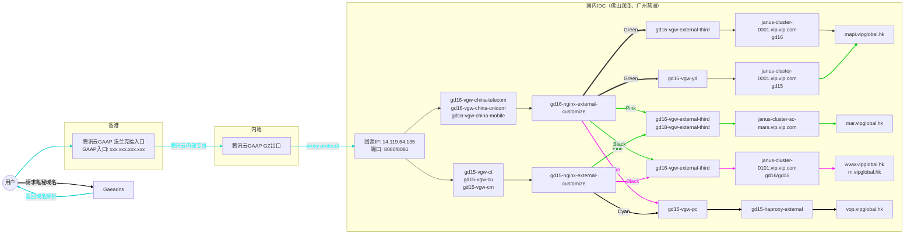

# Architecture Diagram

```mermaid
flowchart LR
    %% Definitions
    User((用户))
    Gaeadns[Gaeadns]

    subgraph HK [香港]
        direction TB
        GAAP_HK[腾讯云GAAP 法兰克福入口<br>GAAP入口: xxx.xxx.xxx.xxx]
    end

    subgraph Mainland [内地]
        direction TB
        GAAP_GZ[腾讯云GAAP GZ出口]
    end

    subgraph IDC [国内IDC（佛山润泽、广州琶洲）]
        direction TB
        Origin[回源IP: 14.119.64.135<br>端口: 8080/8081]
        
        %% Layer 1: Ingress
        L1_GD16[gd16-vgw-china-telecom<br>gd16-vgw-china-unicom<br>gd16-vgw-china-mobile]
        L1_GD15[gd15-vgw-ct<br>gd15-vgw-cu<br>gd15-vgw-cm]

        %% Layer 2: Nginx
        L2_GD16[gd16-nginx-external-customize]
        L2_GD15[gd15-nginx-external-customize]

        %% Layer 3: Service Gateways
        L3_GD16_Ext_Green[gd16-vgw-external-third]
        L3_GD15_YD[gd15-vgw-yd]
        L3_Pink[gd16-vgw-external-third<br>gd18-vgw-external-third]
        L3_GD16_Ext_Black[gd16-vgw-external-third]
        L3_GD15_PC[gd15-vgw-pc]

        %% Layer 4: Clusters
        L4_Janus_0001_16[janus-cluster-0001.vip.vip.com<br>gd16]
        L4_Janus_0001_15[janus-cluster-0001.vip.vip.com<br>gd15]
        L4_Janus_Mars[janus-cluster-sc-mars.vip.vip.com]
        L4_Janus_0101[janus-cluster-0101.vip.vip.com<br>gd16/gd15]
        L4_Haproxy[gd15-haproxy-external]

        %% Layer 5: Domains
        L5_Mapi[mapi.vipglobal.hk]
        L5_Mar[mar.vipglobal.hk]
        L5_WWW[www.vipglobal.hk<br>m.vipglobal.hk]
        L5_VOP[vop.vipglobal.hk]

        %% Connections inside IDC
        Origin --> L1_GD16
        Origin --> L1_GD15
        L1_GD16 --> L2_GD16
        L1_GD15 --> L2_GD15

        %% Green Path (MAPI)
        L2_GD16 == Green ==> L3_GD16_Ext_Green
        L2_GD16 == Green ==> L3_GD15_YD
        L3_GD16_Ext_Green --> L4_Janus_0001_16
        L4_Janus_0001_16 --> L5_Mapi
        L3_GD15_YD --> L4_Janus_0001_15
        L4_Janus_0001_15 --> L5_Mapi

        %% Pink Path (MAR)
        L2_GD16 == Pink ==> L3_Pink
        L2_GD15 == Pink ==> L3_Pink
        L3_Pink --> L4_Janus_Mars
        L4_Janus_Mars --> L5_Mar

        %% Black Path (WWW)
        L2_GD16 == Black ==> L3_GD16_Ext_Black
        L2_GD15 == Black ==> L3_GD16_Ext_Black
        L3_GD16_Ext_Black --> L4_Janus_0101
        L4_Janus_0101 --> L5_WWW

        %% Cyan Path (VOP)
        L2_GD16 == Cyan ==> L3_GD15_PC
        L2_GD15 == Cyan ==> L3_GD15_PC
        L3_GD15_PC --> L4_Haproxy
        L4_Haproxy --> L5_VOP
    end

    %% External Connections
    User -- 请求唯秘域名 --> Gaeadns
    Gaeadns -- 返回域名解析 --> User
    User --> GAAP_HK
    GAAP_HK == 腾讯云内部专线 ==> GAAP_GZ
    GAAP_GZ -- proxy protocol --> Origin

    %% Styling
    %% Green Path
    linkStyle 9,10,11,12,13,14 stroke:#00cc00,stroke-width:2px,color:green;
    %% Pink Path
    linkStyle 15,16,17,18 stroke:#ff00ff,stroke-width:2px,color:magenta;
    %% Black Path
    linkStyle 19,20,21,22 stroke:#000000,stroke-width:2px,color:black;
    %% Cyan Path
    linkStyle 23,24,25,26 stroke:#00cccc,stroke-width:2px,color:cyan;
```
